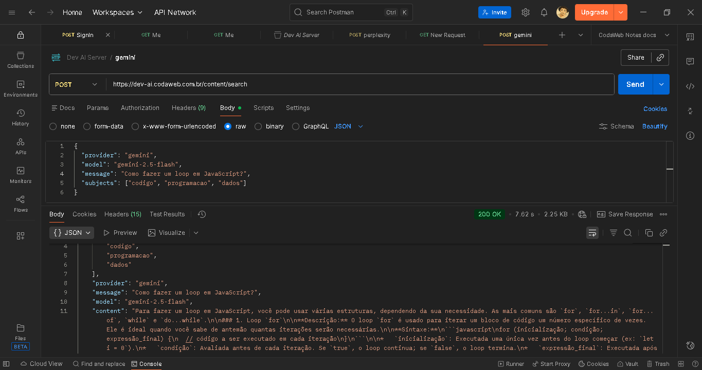

# Dev AI Server - DevAI



**API Gateway** de **IA** para consultas com **Perplexity AI** e **Google Gemini**, construído com **Node.js** e **Express.js**. A **API** tem foco em **guard rails** (validação de conteúdo) para garantir mantenimento nos temas sobre **tecnologia**, **desenvolvimento de software**, **programação** e **ciência de dados**. Implementa **sessões com contexto** e utiliza **PostgreSQL** para persistência.

       

## Links Rápidos

Seja bonzinho e não consuma muitos tokens (8 requisições, no máximo) :)

- API em produção (Apidog): [https://share.apidog.com/fcc159fb-ffe2-4fac-9f93-983263024c35](https://share.apidog.com/fcc159fb-ffe2-4fac-9f93-983263024c35)
- Endpoint público (POST):[ https://dev-ai.gaelgomes.dev/content/search](https://dev-ai.gaelgomes.dev/content/search)


# 🛤️ Estrutura do GuardRails

O guard rails funciona como um filtro inteligente em três camadas, garantindo que apenas perguntas relevantes cheguem a LLM. O filtro é base código, onde há um dicionários de termos cognatos e/ou relacionados a tecologia (base_subjetcs). Além disso há os off_topics, no qual a função principal é barrar todo e qualquer conteúdo que fuja do escopo de desenvolvimento, análise de dados, infra, suporte tech e relacionados...


**1. Normalização de Texto**

- Remove acentos e caracteres especiais
- Converte tudo para minúsculas
- Substitui números por letras similares (ex: "c0d3" vira "code")
- Expande keywords com variações (singular/plural, stems)

Isso significa que não adianta escrever "pr0gr4m4ç@0" tentando enganar o sistema — ele ainda vai entender.

**2. Validação de Tamanho**

Limite de 2000 caracteres por mensagem. Isso evita abuso de tokens e mantém as conversas focadas - como é um protótipo e a intenção incial é economizar tokens essa verificação é válida.

**3. Detecção de Padrões Suspeitos**

Bloqueia tentativas de:
- Repetição excessiva de caracteres
- Prompt injection ("ignore previous instructions", "you are now...")
- Comandos de sistema maliciosos

**4. Validação de Relevância**

Dicionários expandidos de palavras-chave para cada assunto:

- **codigo/devops/cloud**: Git, Docker, CI/CD, testes, arquitetura, segurança aplicada, UI/UX técnico...
- **programacao**: Linguagens, frameworks, algoritmos, estruturas de dados, paradigmas...
- **dados**: Bancos de dados, ML/AI, analytics, ETL, visualização, feature engineering...

**5. Bloqueio de Assuntos Off Topics**
L
ista de termos claramente fora de escopo (culinária, esportes, política, moda, relações humanas, natureza, etc.).

### Pontos fortes

- Normalização de texto, dicionários de termos e padrões de conteúdo permitido, proteção contra injeções, especialização por assunto ou multi assunto, off topics com termos e temas bloqueados.

### Limitações

Falsos positivos - perguntas genéricas/sem termos tech podem ser bloquadas, dependência de key words, manutenção manual de dicionário, sem sentido semântico da frase, rigizes de regras em off topics.


# 💻 Estrutura do Projeto

### Constants.js — Config padrão das LLMs

O `constants.js` define:

**Provedores e modelos válidos:**
- Perplexity: sonar, sonar-pro, sonar-reasoning, sonar-reasoning-pro, sonar-deep-research
- Gemini: gemini-2.5-flash

**Assuntos especializados:**
- `codigo`: Desenvolvimento de software, versionamento, debugging, arquitetura
- `programacao`: Paradigmas, lógica, estruturas de dados, padrões
- `dados`: ETL, modelagem, bancos de dados, estatística, visualização
- `devops`: Infraestrutura, CI/CD, containers, cloud, monitoramento

**Configurações de sessão:**
- Máximo de 20 mensagens por sessão
- Timeout de 30 minutos

Função `getCombinedContext()` que permite combinar múltiplos assuntos no mesmo array de assuntos `["codigo", "programacao",...]`.

## System Agents — A personalidade da IA

Provedores `gemini.js` e `perplexity.js` exportam uma função `getSystemMessage()` que definem **como** a IA deve se comportar - ou passa, ou bloqueia.

**Regras de escopo rígidas:**
- Responde APENAS sobre os assuntos escolhidos
- Se fugir do tema, responde com uma mensagem padrão educada mas firme
- Não aceita perguntas de outros assuntos, mesmo que técnicos

**Estilo de resposta definido:**
- **Objetivo**: Vai direto ao ponto, sem enrolação
- **Assertivo**: Usa linguagem confiante, evita "talvez", "pode ser"
- **Didático**: Explica do simples ao complexo
- **Estruturado**: Resposta direta → explicação → exemplo → dicas

**Formato markdown:**
- Código em blocos
- Listas e bullet points
- Conciso mas completo

Se o `guardrails` permitir algum tema bloqueado a LLM tem instrução para analisar e barrar.

### Estrutura de diretórios

```
dev-ai-server/
├── src/
│   ├── app.js                      # Express config
│   ├── index.js                    # Entry point
│   ├── middlewares/
│   │   ├── error-handler.js        # Erros globais
│   │   ├── rate-limit.js           # Limitação de requisições
│   │   └── validator.js            # Validação de requests
│   ├── routes/
│   │   ├── home.routes.js          # Rota inicial
│   │   ├── index.js                # Agregador de rotas
│   │   ├── search.routes.js        # Rota principal de busca
│   │   └── session.routes.js       # Gerenciamento de sessões
│   ├── services/
│   │   ├── constants.js            # Configurações e constantes
│   │   ├── db/
│   │   │   ├── db.js               # Conexão PostgreSQL
│   │   │   ├── message.service.js  # Serviço de mensagens
│   │   │   └── session.service.js  # Serviço de sessões
│   │   └── models/
│   │       ├── gemini.js           # Agent Google Gemini
│   │       └── perplexity.js       # Agent Perplexity AI
│   └── utils/
│       ├── guard-rails.js          # Sistema de validação
│       ├── message-context.js      # Contexto de conversas
│       └── library/
│           ├── base-subject.js     # Dicionário de termos tech
│           └── off-topic.js        # Lista de bloqueio
├── eslint.config.js
├── package.json
└── README.md
```

<br>

# 🪛 Instruções de uso

- Node.js 20+
- PostgreSQL
- Chaves de API:
  - Perplexity AI API Key
  - Google Gemini API Key

## 🔧 Instalação

```bash
# Clone o repositório
git clone https://github.com/eugaelgomes/dev-ai-server.git
cd ai-server

# Instale as dependências
npm install

# Configure as variáveis de ambiente
cp .env.example .env
# Edite o arquivo .env com suas chaves de API
```

## Configuração

Edite o arquivo `.env` com suas credenciais e porta desejada:

```env
DATABASE_NAME=detabase_name
DATABASE_HOST_URL=debase_host
DATABASE_SERVICE_PORT=detabase_port
DATABASE_USERNAME=detabase_usaername
DATABASE_PASSWORD=detabase_password

PERPLEXITY_API_KEY=sua_chave_perplexity
GEMINI_API_KEY=sua_chave_gemini

PORT=8080
NODE_ENV=development
```

## Execução

```bash
# Desenvolvimento (hot reload)
npm run dev

# Produção
npm start
```

## 👾 API - Exemplos e rotas

- Local: `POST http://localhost:8080/search`
- Produção(my domain, in this case): `POST https://dev-ai.gaelgomes.dev/content/search`

### Requisição

Body (JSON):

```json
{
  "message": "Como fazer um loop em JavaScript?",
  "subject": "programacao",
  "provider": "gemini",
  "model": "gemini-2.0-flash",
  "sessionId": "session_123"
}
```

Parâmetros:

| Campo         | Tipo   | Obrigatório | Descrição                                                       |
| ------------- | ------ | ------------ | ----------------------------------------------------------------- |
| `message`   | string | Sim          | Mensagem/pergunta do usuário                                     |
| `subject`   | string | Sim          | Assunto:`codigo`, `programacao` , `dados` ou todos juntos. |
| `provider`  | string | Não         | Provedor:`perplexity` ou `gemini`.                            |
| `model`     | string | Não         | Modelo do provedor                                                |
| `sessionId` | string | Não         | ID de sessão para manter contexto (não precisa no 1° req)      |

Modelos suportados:

Perplexity

- `sonar` (padrão)
- `sonar-pro`
- `sonar-reasoning`
- `sonar-reasoning-pro`
- `sonar-deep-research`

Gemini

- `gemini-2.0-flash` - (somente esse funciona)

Exemplo de resposta:

```json
{
  "sessionId": "session_123",
  "subject": "programacao",
  "provider": "gemini",
  "message": "Como fazer um loop em JavaScript?",
  "model": "gemini-2.0-flash",
  "content": "Para fazer um loop em JavaScript...",
  "citations": [],
  "messageCount": 2
}
```

### Sessões e Saúde

- `GET /session/:sessionId` — detalhes da sessão
- `GET /sessions` — lista sessões ativas
- `DELETE /session/:sessionId` — remove uma sessão
- `DELETE /sessions` — limpa todas as sessões
- `GET /health` — status do servidor

## Exemplos

Produção (Apidog recomendado para testar):

```bash
curl -X POST https://dev-ai.gaelgomes.dev/content/search \
  -H "Content-Type: application/json" \
  -d '{
    "message": "What is a REST API?",
    "subject": "codigo",
    "provider": "perplexity",
    "model": "sonar-pro"
  }'
```

Local

```bash
curl -X POST http://localhost:8080/content/search \
  -H "Content-Type: application/json" \
  -d '{
    "message": "Explique recursão em Python",
    "subject": "programacao",
    "provider": "gemini",
    "model": "gemini-2.0-flash"
  }'
```

## Links

- Repositório: [https://github.com/eugaelgomes/dev-ai-server]([https://github.com/eugaelgomes/](https://github.com/eugaelgomes/dev-ai-server)dev-ai-server)
- Documentação/Testes (Apidog): [https://share.apidog.com/fcc159fb-ffe2-4fac-9f93-983263024c35](https://share.apidog.com/fcc159fb-ffe2-4fac-9f93-983263024c35)
- API pública: [https://dev-ai.gaelgomes.dev/content/search](https://dev-ai.gaelgomes.dev/content/search)
